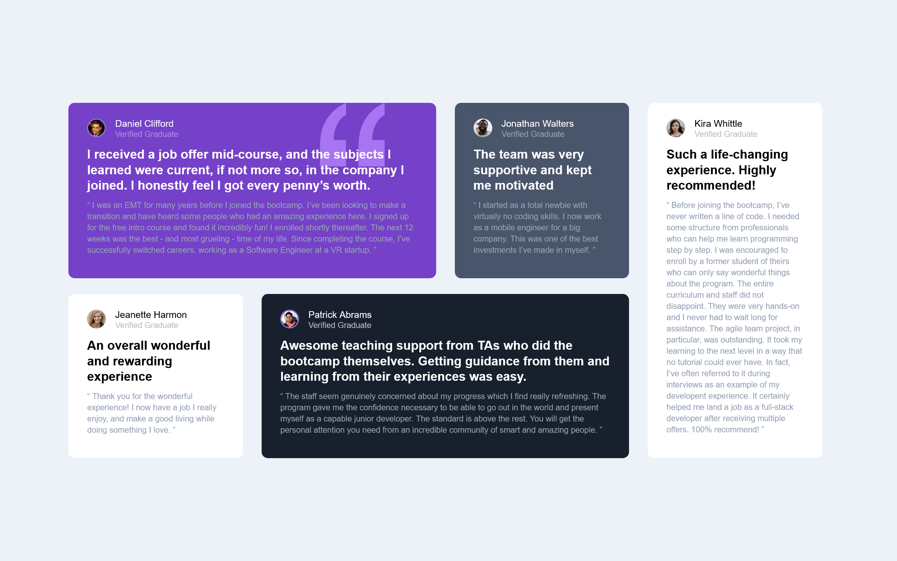

# Frontend Mentor - Testimonials grid section solution

This is a solution to the [Testimonials grid section challenge on Frontend Mentor](https://www.frontendmentor.io/challenges/testimonials-grid-section-Nnw6J7Un7). Frontend Mentor challenges help you improve your coding skills by building realistic projects. 

## Table of contents

- [Overview](#overview)
  - [The challenge](#the-challenge)
  - [Screenshot](#screenshot)
- [My process](#my-process)
  - [Built with](#built-with)
  - [What I learned](#what-i-learned)
  - [Continued development](#continued-development)
  - [Useful resources](#useful-resources)
- [Author](#author)


## Overview

### The challenge

Users should be able to:

- View the optimal layout for the site depending on their device's screen size

### Screenshot




## My process

### Built with

- Semantic HTML5 markup
- CSS custom properties
- Flexbox
- CSS Grid

### What I learned
To see how you can add code snippets, see below:

```css
.proud-of-this-css {
  #gridContainer
  {
     display:grid;
    
     grid-template-areas: 'daniel daniel jonathan kira' 
                            'jeanette patrick patrick kira';
    grid-auto-columns: 265px;
    grid-auto-columns: 280px;
     column-gap:30px;
     gap: 10px;
     background-color: #EDF2F8; 
     border:2px solid none;
     width:1220px;
    height:570px;
     margin:auto auto;
     column-gap: 30px;
     row-gap:25px;
  }
}
```


### Continued development

This project is my first project which I created using "CSS Grid".
And I will practice CSS Grid in my upcoming projects


### Useful resources

- [Example resource 1](https://www.w3schools.com/css/css_grid.asp) - This helped me for learning CSS Grid. I really liked this website and will use it going forward.

## Author
- Frontend Mentor - [@Todaymore](https://www.frontendmentor.io/profile/Todaymore)
