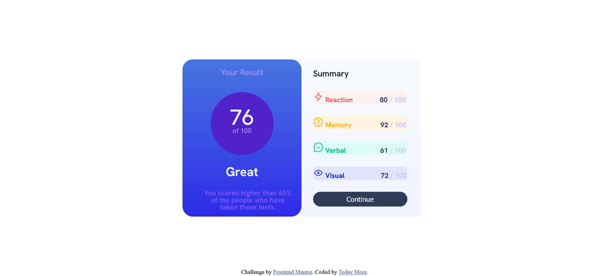

# Frontend Mentor - Results summary component solution

This is a solution to the [Results summary component challenge on Frontend Mentor](https://www.frontendmentor.io/challenges/results-summary-component-CE_K6s0maV). Frontend Mentor challenges help you improve your coding skills by building realistic projects. 

## Table of contents

- [Overview](#overview)
  - [The challenge](#the-challenge)
  - [Screenshot](#screenshot)
- [My process](#my-process)
  - [Built with](#built-with)
  - [What I learned](#what-i-learned)
  - [Continued development](#continued-development)
  - [Useful resources](#useful-resources)
- [Author](#author)
- [Acknowledgments](#acknowledgments)

## Overview

### The challenge

Users should be able to:

- View the optimal layout for the interface depending on their device's screen size
- See hover and focus states for all interactive elements on the page

### Screenshot

## My process

### Built with

- Semantic HTML5 markup
- CSS custom properties
- Flexbox
- Mobile-first workflow

### What I learned

I learn that sometimes px is not a standard value.
For example if I open a image in paint app then width of 100px of paint app does not match to browser's 100px. Both are 100px but different in size.
And sometimes within browser, 200px is bigger than standard 200px and so on.
I know it sounds confusing because I am also not clear regarding to measurement values(px,em,cm,mm,pt,etc).

### Continued development

I have theory knowledge of html,css and js but when we apply this in code then logic goes somewhere else!
So I practice more to strong my commands on practical approach.

### Useful resources
W3Schools.com is helpful regarding to many topics such as [Linear Gradient, Vertical-align,etc.]

## Author

- Frontend Mentor - [@Todaymore](https://www.frontendmentor.io/profile/Todaymore)

## Acknowledgments

This message for my all fellow coders:
            Consistency is the key!
            Once you cross the valley of disappointment,
            You progress is increase exponentially...

