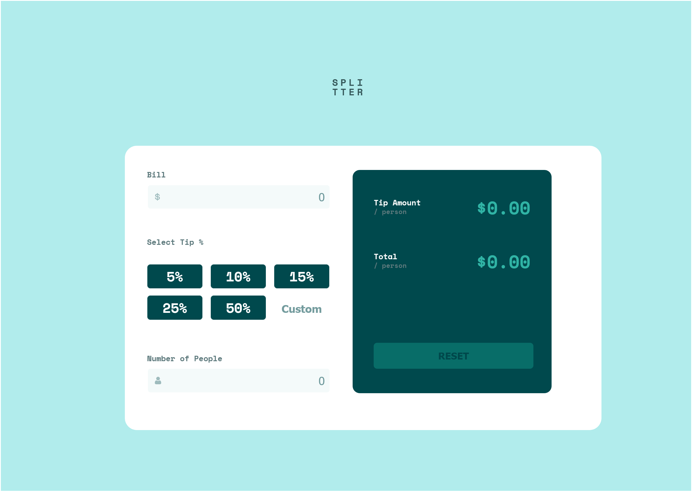

# Frontend Mentor - Tip calculator app solution

This is a solution to the [Tip calculator app challenge on Frontend Mentor](https://www.frontendmentor.io/challenges/tip-calculator-app-ugJNGbJUX). Frontend Mentor challenges help you improve your coding skills by building realistic projects.

## Table of contents

- [Overview](#overview)
  - [The challenge](#the-challenge)
  - [Screenshot](#screenshot)
- [My process](#my-process)
  - [Built with](#built-with)
  - [Continued development](#continued-development)
  - [Useful resources](#useful-resources)
- [Author](#author)

## Overview

### The challenge

Users should be able to:

- View the optimal layout for the app depending on their device's screen size
- See hover states for all interactive elements on the page
- Calculate the correct tip and total cost of the bill per person

### Screenshot

Hold ctrl and click on Screenshot to view

## My process

### Built with

- Semantic HTML5 markup
- CSS custom properties
- Mobile-first workflow - I want to try that

### Continued development
I will work on 
Responsive Design and Flex Box
becuase right now it is my weak spot.

### Useful resources
W3Schools.com

## Author

- Frontend Mentor - [@Today more](https://www.frontendmentor.io/profile/Todaymore)

